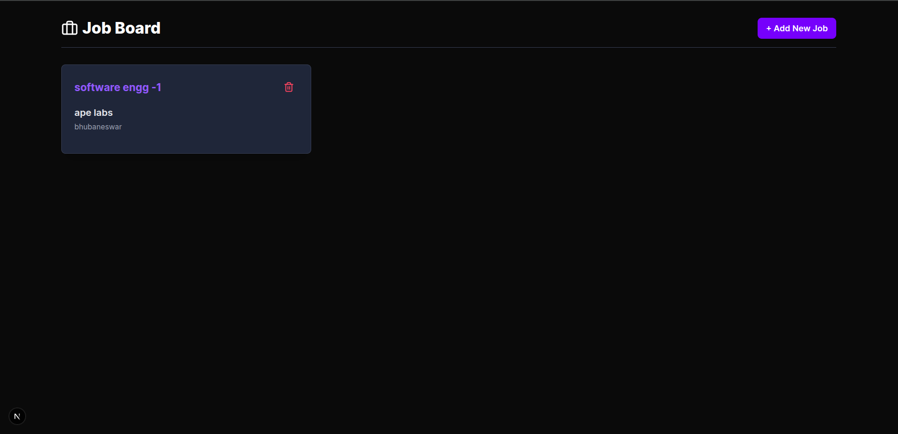
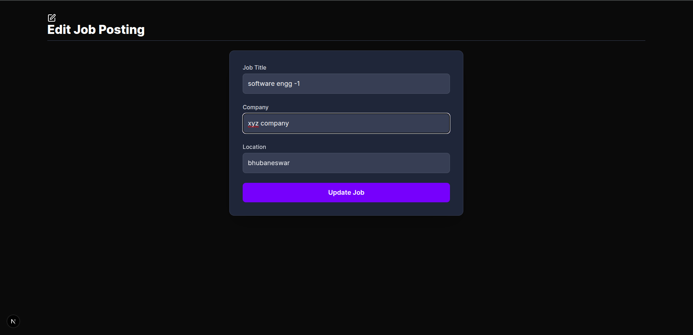
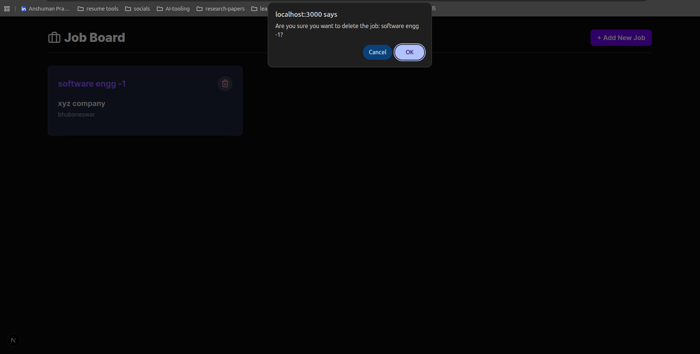
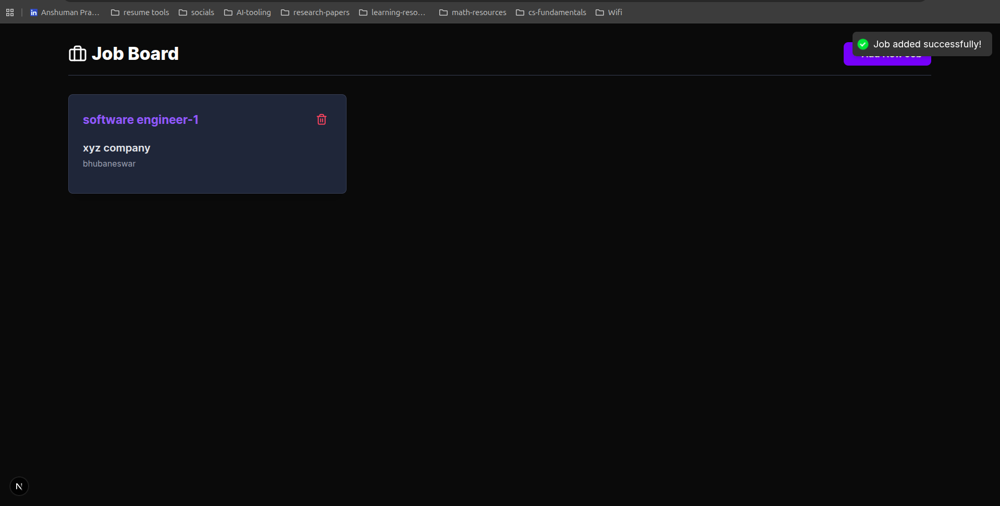

# job board

### Tech Stack i have used

#### Frontend

- **Framework**: [Next.js 16](https://nextjs.org/)
- **Language**: [TypeScript](https://www.typescriptlang.org/)
- **Styling**: [TailwindCSS 4](https://tailwindcss.com/)


#### Backend

- **Runtime**: [Node.js](https://nodejs.org/)
- **Framework**: [Express 5](https://expressjs.com/)
- **Database**: [MongoDB](https://www.mongodb.com/) with [Mongoose 9](https://mongoosejs.com/)
- **Validation**: [Zod](https://zod.dev/)

#### Set up & Run Instructions

#### Backend

1.  Navigate to the `backend` directory:

    ```bash
    cd backend
    ```

2.  Install dependencies:

    ```bash
    npm install
    ```

3.  Create a `.env` file in the `backend` directory and add the following environment variables:

    ```env
    MONGODB_URI=your_mongodb_connection_string
    PORT=8000
    ```

4.  Start the server:
    ```bash
    npm run server
    ```
    The server will start on `http://localhost:8000`.

#### Frontend

1.  Navigate to the `frontend` directory:

    ```bash
    cd frontend
    ```

2.  Install dependencies:

    ```bash
    npm install
    ```
3.  Create a `.env.local` file in the `frontend` directory and add the following environment variables:

    ```env
   NEXT_PUBLIC_API_BASE_URL=http://localhost:8000/api/v1/jobs
    ```


4.  Start the development server:
    ```bash
    npm run dev
    ```
    The application will be available at `http://localhost:3000`.


### UI snaps:

listedd jobs

updating 

deletion with confirmation

with toast/notification


